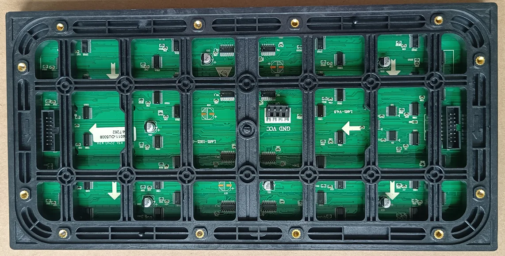
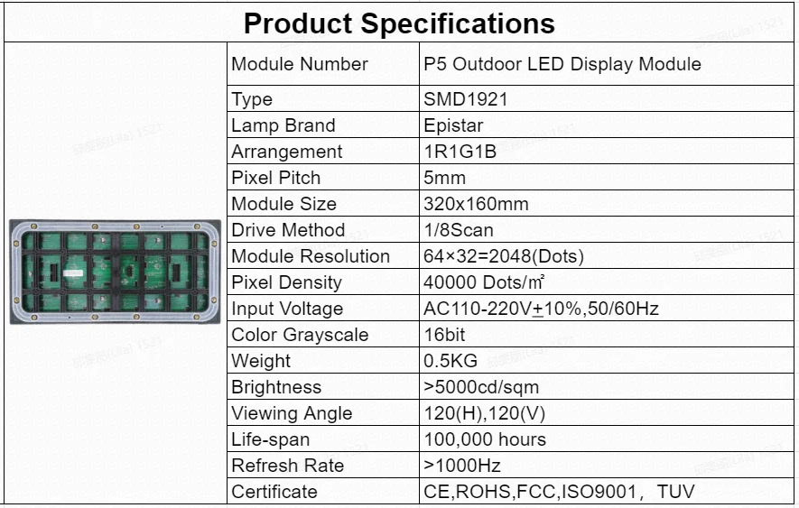

# ESP32-S3 + LED P5 OUTDOOR SMD1921 MATRIX PANEL

## ภาษาไทย (Thai)
[ดูเอกสารคู่มือภาษาไทยที่นี่](docs/th-docs.md)

This project demonstrates controlling a **P5 OUTDOOR SMD1921 HUB75 LED matrix panel** with an **ESP32-S3** board.

Includes multiple display demo functions and robust panel mapping (multi-panel support).

## Project Structure

```bash
.
├── boards/
│ └── esp32-s3-devkitc-n16r8v1.1.json
├── docs/
│ ├── image1.png
│ └── image2.png
├── include/
│ └── README
├── lib/
│ ├── Adafruit BusIO
│ ├── Adafruit GFX Library
│ └── ESP32 HUB75 LED MATRIX PANEL DMA Display
│ └── README
├── src/
│ └── main.cpp
├── test/
│ └── README
├── .gitignore
├── platformio.ini
└── README.md
```

---

## Hardware Information

- **MCU**: ESP32-S3
- **LED PANEL**: P5 OUTDOOR SMD1921, HUB75, 64x32px per panel
- **Panel configuration:** 2 columns x 3 rows (6 panels total)
- **Power supply:** 5V (≥2A recommended)

## Panel Mapping
```
		       Size (128x96)
		    +-------+-------+
      IN →  | 1 → △ | 2 ↓ △ |
   		    +-------+-------+
			| 4 ↓ ▽ | 3 ← ▽ |
			+-------+-------+
			| 5 → △ | 6 ↓ △ |
			+-------+-------+
```

### Pin Mapping

| Signal | ESP32-S3 GPIO |
| --- | --- |
| R1 | 36 |
| G1 | 38 |
| B1 | 40 |
| R2 | 35 |
| G2 | 16 |
| B2 | 4 |
| A | 2 |
| B | 18 |
| C | 42 |
| D | 21 |
| LAT | 1 |
| OE | 9 |
| CLK | 8 |
| E | -1 |

---

## Usage

### 1. Required Libraries

- [ESP32-HUB75-MatrixPanel-I2S-DMA](https://github.com/mrfaptastic/ESP32-HUB75-MatrixPanel-I2S-DMA)
- [Adafruit GFX Library](https://github.com/adafruit/Adafruit-GFX-Library)
- [Adafruit BusIO](https://github.com/adafruit/Adafruit_BusIO)

### 2. Upload with [PlatformIO](https://platformio.org/)

- Open this folder in VSCode + PlatformIO extension
- Upload `src/main.cpp` to your ESP32-S3 board

### 3. Example Output

- Tests basic colors, text, scrolling marquee, graphics, etc.
- Displays panel mapping, resolution, border, X marker, and more

---

## Features in This Demo

- Text and number display, color tests, and graphics
- Scrolling marquee message
- Drawing lines, borders, and custom patterns
- Multi-panel mapping and composition
- On-screen resolution and per-panel labeling for hardware debugging

---

## Example Output
<p align="center">
  
  
</p>
---

## Credits and More Info

- Library: [ESP32-HUB75-MatrixPanel-I2S-DMA](https://github.com/mrfaptastic/ESP32-HUB75-MatrixPanel-I2S-DMA)
- Author: [LEKPCSTEAM](https://github.com/lekpcsteam)
- License: MIT

---

## Notes

- If the display output is scrambled, try changing the panel chain type or setRotation, or check wiring
- If the panel blinks or loses color, check your 5V power supply

---